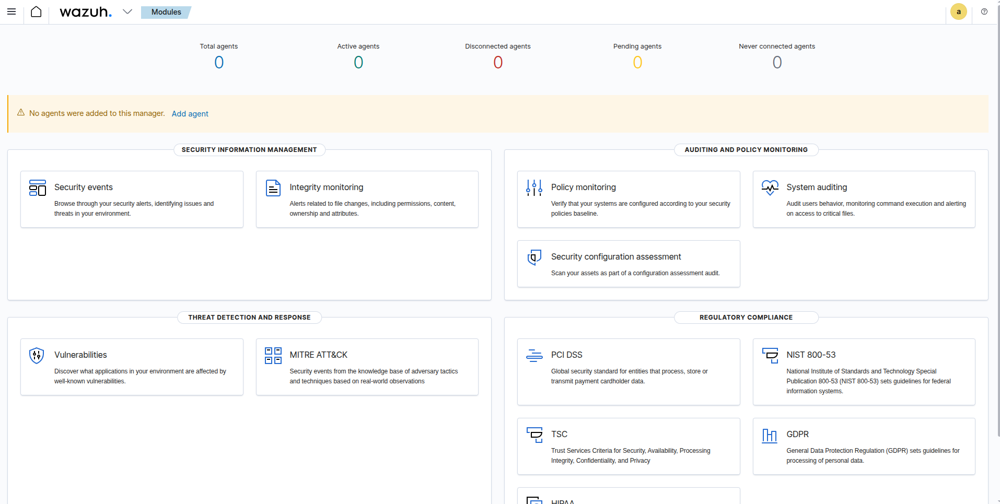
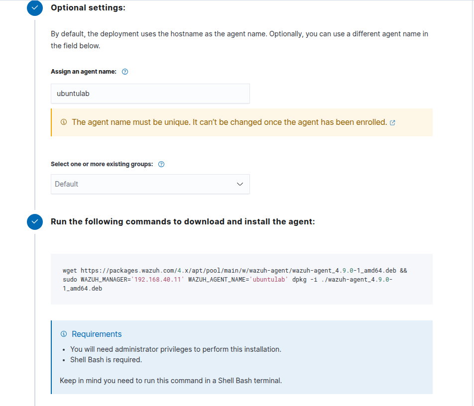
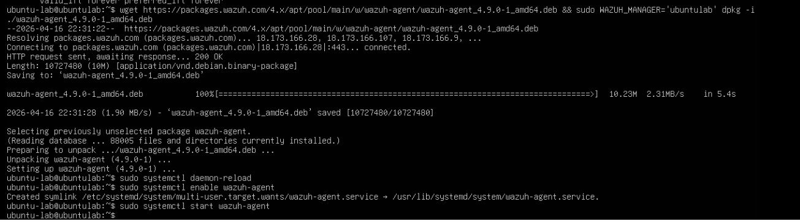
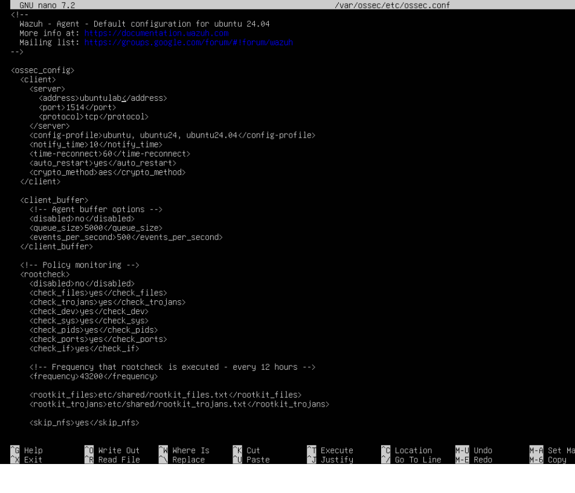
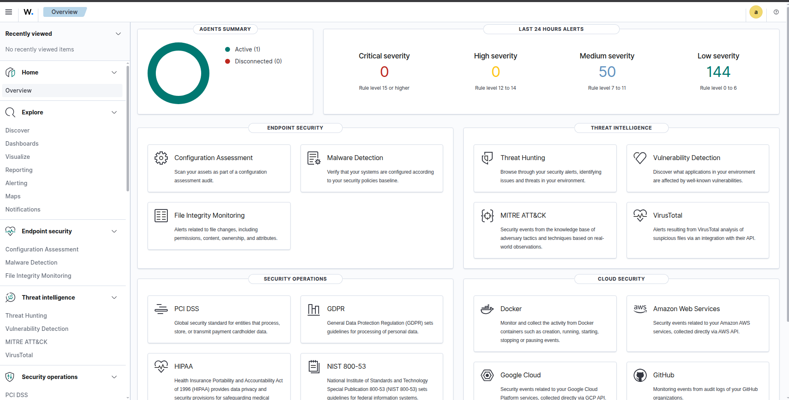
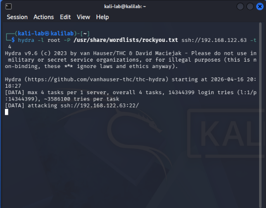
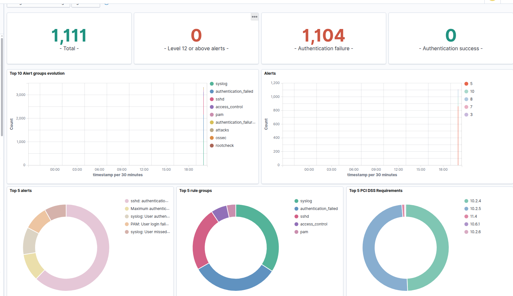
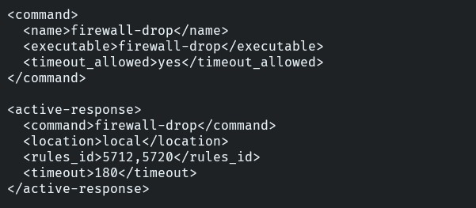
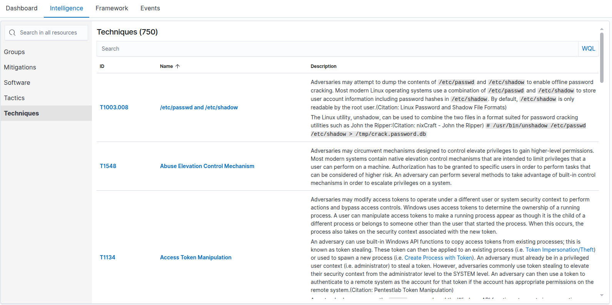
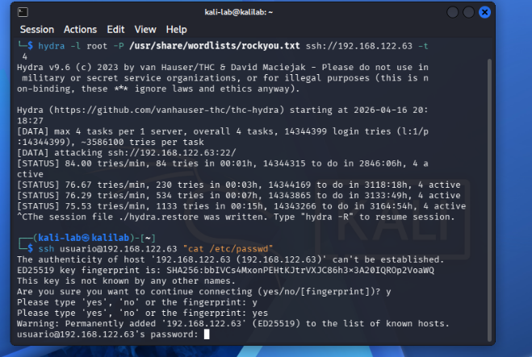

# Lab SIEM: Implementación de Wazuh en Home Lab de Ciberseguridad

## Resumen ejecutivo
Este laboratorio documenta la implementación de un entorno SIEM funcional con Wazuh para monitoreo, detección y respuesta ante incidentes en un escenario controlado.
Durante la práctica se desplegó la plataforma, se integró un endpoint Linux, se simuló un ataque de fuerza bruta SSH y se validó la capacidad de contención automática.

## Objetivos del laboratorio
- Centralizar eventos de seguridad en una única plataforma.
- Detectar actividad maliciosa basada en intentos de autenticación fallidos.
- Activar respuestas automáticas para reducir el tiempo de exposición.
- Fortalecer competencias prácticas orientadas a roles SOC/Blue Team.

## Arquitectura del entorno
| Rol | Sistema | Función |
|---|---|---|
| SIEM | Ubuntu Server + Docker + Wazuh | Recolección, correlación y visualización de eventos |
| Endpoint objetivo | Ubuntu Server | Fuente de logs y telemetría de seguridad |
| Equipo atacante | Kali Linux | Simulación de ataque controlado |

## Stack tecnológico
- Wazuh (Manager, Indexer, Dashboard)
- Docker
- Ubuntu Server
- Kali Linux
- Hydra
- SSH
- KVM / Virtualización

---

## 1) Despliegue de Wazuh SIEM
### Instalación base

```bash
git clone https://github.com/wazuh/wazuh-docker.git -b v4.9.0 
cd wazuh-docker/single-node 
docker-compose up -d
```

Lo instale en docker para dejar un entorno limpio y que no haya errores.
### Componentes instalados
- Wazuh Manager
- Wazuh Dashboard
- Wazuh Indexer

### Evidencia


---

## 2) Integración del agente objetivo
### Registro del agente


### Instalación del agente en Ubuntu Server


### Problema identificado
El agente no lograba comunicarse correctamente con el manager.

### Solución aplicada
Se ajustó la configuración del archivo `/var/ossec/etc/ossec.conf`, reemplazando el `hostname` por la IP real del servidor Wazuh.



### Resultado
El agente quedó conectado y reportando eventos de forma estable.



---

## 3) Simulación de ataque real
Para generar eventos de seguridad reales, se ejecutó una prueba de fuerza bruta SSH desde Kali Linux usando Hydra:

```bash
hydra -l root -p 1111 ssh://IP_OBJETIVO
```



### Objetivo de la simulación
- Generar telemetría maliciosa controlada.
- Validar la detección en tiempo real del SIEM.
- Medir capacidad de respuesta defensiva.

---

## 4) Detección y análisis de eventos
Wazuh detectó múltiples intentos fallidos de autenticación SSH y los clasificó como actividad sospechosa.



### Eventos observados
- `Failed password`
- `Invalid credentials`
- `Multiple login attempts`
- `Possible brute force`

---

## 5) Respuesta automática (Active Response)
Se configuró **Active Response** para bloquear automáticamente la IP atacante tras superar el umbral de intentos fallidos.



### Beneficios
- Contención inmediata de la amenaza.
- Reducción del tiempo de exposición.
- Automatización del flujo defensivo.

---

## 6) Threat Intelligence
Se revisó el módulo de inteligencia de amenazas para enriquecer la investigación de eventos y acelerar el análisis contextual.



### Valor operativo
- Enriquecimiento de IOC.
- Priorización de eventos.
- Mejor contexto para toma de decisiones.

---

## 7) Validación posterior al bloqueo
Se realizó una nueva prueba desde Kali Linux para confirmar la efectividad de la contención:

```bash
ssh usuario@IP_OBJETIVO "cat /etc/passwd"
```



### Resultado
La respuesta automática limitó la actividad maliciosa y confirmó la eficacia del control defensivo.

---

## Hallazgos técnicos
### Capacidades Blue Team
- SIEM Deployment
- Log Monitoring
- Threat Detection
- Incident Response
- Active Response

### Capacidades Red Team
- Uso de Hydra
- Simulación de brute force
- Validación de controles de seguridad

### Competencias Linux / Sysadmin
- Troubleshooting de agentes
- Ajustes de configuración
- Networking y servicios Linux

---

## Mejoras futuras
- Integrar Suricata IDS.
- Incorporar Sysmon + eventos de Windows.
- Diseñar dashboards personalizados por caso de uso.
- Mapear alertas a MITRE ATT&CK.
- Añadir alertas por correo o mensajería.
- Implementar un honeypot interno para detección temprana.

---

## Conclusión
El laboratorio demuestra una cadena completa de defensa: **despliegue**, **detección**, **análisis** y **respuesta automática** frente a una técnica de ataque real.
Este enfoque práctico fortalece habilidades clave para posiciones como SOC Analyst, Blue Team Analyst y Cybersecurity Analyst, con una base sólida para evolucionar hacia entornos empresariales más complejos.
